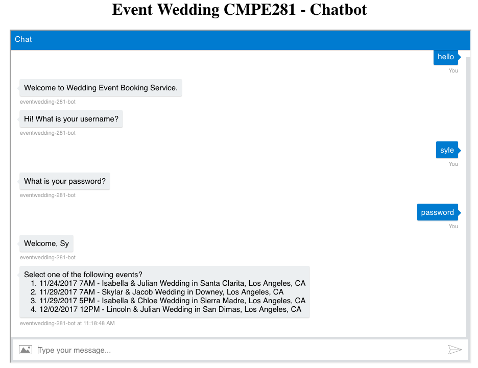
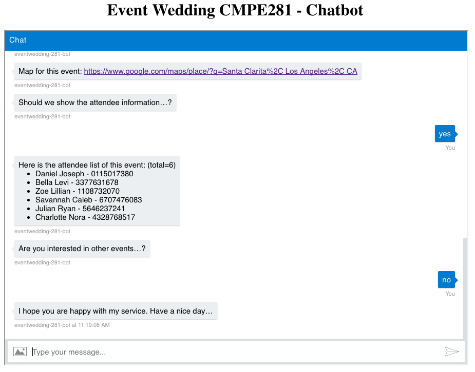

# azure-event-wedding-chatbot
## CMPE 281 Final Project - Chatbot section
- Student: Sy Le (https://www.linkedin.com/in/syle1021/)
- University Name: San Jose State University (http://www.sjsu.edu/)
- Course: Cloud Technologies (http://info.sjsu.edu/web-dbgen/catalog/courses/CMPE281.html)
- Professor Sanjay Garje (https://www.linkedin.com/in/sanjaygarje/)
- ISA: Divyankitha Urs (https://www.linkedin.com/in/divyankithaurs/)


## Urls
- (Demo Url)[http://eventplanner.themodestwhite.com]

### Sample Demo Screenshots




### Sources/Links:
- https://docs.microsoft.com/en-us/bot-framework/nodejs/bot-builder-nodejs-quickstart
- https://docs.microsoft.com/en-us/bot-framework/nodejs/bot-builder-nodejs-overview
- https://docs.microsoft.com/en-us/bot-framework/nodejs/bot-builder-nodejs-dialog-manage-conversation-flow
- https://github.com/Microsoft/BotFramework-Emulator/releases
- https://medium.com/the-node-js-collection/bots-are-banging-getting-started-with-the-microsoft-bot-framework-node-js-b16ccb96b32f
- https://docs.microsoft.com/en-us/bot-framework/deploy-bot-local-git

- https://docs.microsoft.com/en-us/azure/stream-analytics/stream-analytics-power-bi-dashboard
- https://docs.microsoft.com/en-us/bot-framework/rest-api/bot-framework-rest-connector-authentication


- https://docs.microsoft.com/en-us/azure/mysql/howto-configure-ssl
- https://stackoverflow.com/questions/13406663/how-can-i-allow-unknown-users-to-access-my-sql-azure-db


### Mocking the database
```
node nukecache.js ; node nukedata.js ; node mockdata.js
```
